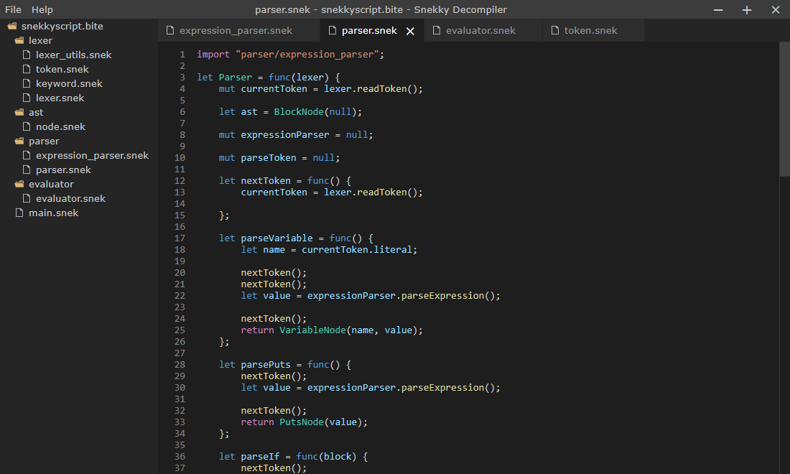

# Snekky Decompiler GUI

A GUI frontend for [snekkyd](https://github.com/snekkylang/snekkyd-gui) made with [Sciter](https://sciter.com/). It allows you to decompile Snekky bytecode files (`.bite` extension) and browse their contents a in VSCode-like interface.

## Screenshots

## Installation
Download the latest version for your operating system of choice from the [releases page](https://github.com/snekkylang/snekkyd-gui/releases) or the latest build from the [actions tab](https://github.com/snekkylang/snekkyd-gui/actions).